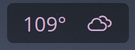

# Weather Widget Plus (Transparent)

[](https://kde.org/plasma-desktop/)
[](https://doc.qt.io/qt-6/qtqml-index.html)
[](https://api.met.no/)
[](LICENSE)

A clean, transparent-background KDE Plasma 6 weather widget displaying current conditions, hourly/daily forecasts, and graphical meteograms. Built as a customized fork of [Weather Widget Plus](https://github.com/tully-t/weather-widget-plus), designed to blend seamlessly into any desktop wallpaper, panel, or widget container without opaque card backgrounds.

---

## Previews

### Transparent Desktop Widget


### Desktop Overview


---

## Features

- **Transparent Background**: Fully transparent container background that blends into any desktop wallpaper or panel setup.
- **Multiple Data Providers**: Live weather updates from [met.no](https://api.met.no/) (Norwegian Meteorological Institute), [Open-Meteo](https://open-meteo.com/), or [OpenWeatherMap](https://openweathermap.org/).
- **Meteogram View**: High-resolution graphical forecast charts showing temperature trends, precipitation, and cloud cover.
- **Hourly & Daily Forecasts**: Multi-day breakdown with temperature ranges, wind speed, pressure, and humidity.
- **Multi-Location Support**: Save and switch between multiple locations by city name or GPS coordinates.
- **Adaptive Layout Modes**: Supports Horizontal, Vertical, and Compact layout orientations for desktop or panel placement.
- **Localized**: Full multi-language support (English, German, Spanish, Czech, Russian, Dutch, Norwegian, Swedish, etc.).

---

## Requirements

- **Environment**: KDE Plasma 6.0 or higher
- **Network**: Active internet connection for live weather API fetches
- **API Keys**: No API key required for *met.no* or *Open-Meteo*; optional OpenWeatherMap API key supported.

---

## Installation

### Option 1: Git Clone (Recommended)
Clone directly into your user plasmoids directory:

```bash
mkdir -p ~/.local/share/plasma/plasmoids/
git clone https://github.com/PlasmaDrifter/weather-transp.git ~/.local/share/plasma/plasmoids/local.widget.weather-transp
```

### Option 2: Plasma Package Installer
```bash
kpackagetool6 -i ~/.local/share/plasma/plasmoids/local.widget.weather-transp
```

After installation:
1. Right-click your desktop or panel $\rightarrow$ **Add Widgets...**
2. Search for **Weather Widget Plus Trans** and drag it onto your desktop or panel.

---

## Configuration Options

Right-click the widget $\rightarrow$ **Configure Weather Widget Plus Trans…**

| Option | Description |
| :--- | :--- |
| **Location** | Search and add one or multiple cities or geographic coordinates. |
| **Weather Provider** | Choose between `met.no` (default, keyless), `Open-Meteo`, or `OpenWeatherMap`. |
| **Temperature Unit** | Select Celsius ($^\circ\text{C}$), Fahrenheit ($^\circ\text{F}$), or Kelvin ($\text{K}$). |
| **Wind Speed Unit** | $\text{m/s}$, $\text{km/h}$, or $\text{mph}$. |
| **Pressure Unit** | $\text{hPa}$, $\text{inHg}$, or $\text{mmHg}$. |
| **Layout Mode** | Switch between Horizontal, Vertical, or Compact layouts. |
| **Reload Interval** | Data refresh frequency (in minutes). |

---

## Credits & License

- **Original Authors**: Tully Turk, Kate Buckley, Martin Kotelnik ([Weather Widget Plus](https://github.com/tully-t/weather-widget-plus))
- **Transparent Customizations**: PlasmaDrifter
- **License**: Licensed under the [GNU General Public License v2](LICENSE).
